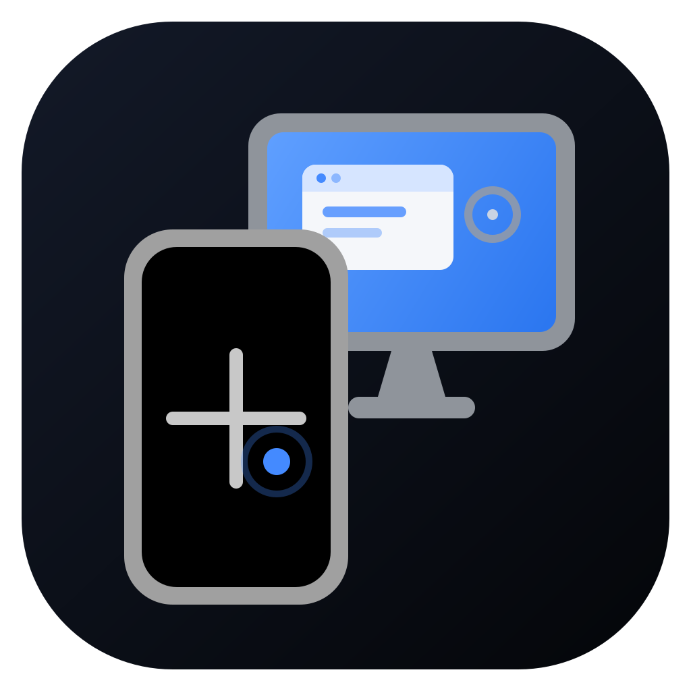
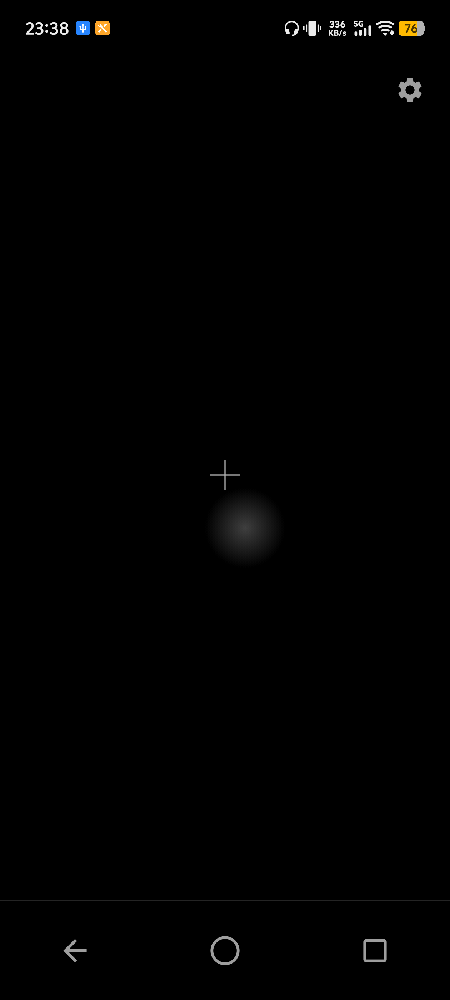

<p align="center">
  
</p>

<h1 align="center">External Display Touchpad</h1>

<p align="center">
  Androidスマートフォンを、外部ディスプレイ専用のタッチパッドとして使うFlutterアプリ
</p>

<p align="center">
  <a href="LICENSE"></a>
  
  
</p>

External Display Touchpadは、HDMI、DisplayPort、ワイヤレスディスプレイなどで接続した外部画面を、スマートフォンのタッチ操作で扱うためのAndroidアプリです。外部画面上に仮想カーソルを表示し、カーソル移動、クリック、長押し、ドラッグ、スクロール、ホーム操作、アプリ起動を行えます。

root、Shizuku、ADB常駐、非公開APIには依存しません。Androidの公開マルチディスプレイAPIとAccessibilityServiceを使用します。

> [!IMPORTANT]
> このプロジェクトは開発中です。Android 16（API 36）以上であっても、connected displays / desktop windowingの実装は端末メーカーによって異なります。すべての端末やアプリでの動作は保証されません。また、現時点では正式に署名した配布用APKを提供していません。

<p align="center">
  
</p>

## できること

- 1本指の相対移動で外部画面の仮想カーソルを操作
- タップでクリック、長押しでAndroidのロングクリック
- 長押ししたまま動かしてドラッグ
- 2本指でスクロールとフリング
- 外部画面向けの戻る、ホーム、アプリ一覧操作
- インストール済みアプリを検索して外部画面で起動
- 外部ディスプレイの解像度とリフレッシュレートを選択
- 外部画面用のホームアプリを選択
- 外部ディスプレイ接続時の自動起動と常駐監視
- 5秒、10秒、30秒から選べるタッチロック
- ロック中の最低輝度、半透明表示、OLED保護用ピクセルシフト
- カーソル速度、長押し時間、自動非表示時間などの調整
- 日本語、英語、中国語、韓国語、スペイン語、ロシア語、ドイツ語に対応

## 動作要件

| 項目 | 要件 |
|---|---|
| OS | Android 16（API 36）以上 |
| 端末 | 外部ディスプレイ上でActivityを実行できる端末 |
| 外部画面 | HDMI / DisplayPort / 対応するワイヤレスディスプレイなど |
| Android機能 | connected displays、desktop windowing、または同等のOEM機能 |
| 必須設定 | 本アプリのAccessibilityServiceを利用者が有効化 |

Androidのバージョンだけでは対応可否を判断できません。映像のミラーリングしか提供しない端末や、外部ディスプレイへのActivity起動を許可しない端末では利用できません。

iOS、Windows、macOS、Linux向けのアプリは提供していません。

## インストール

現在は正式なリリースAPKがないため、Flutter開発環境からビルドして端末へインストールします。

### 開発環境

- Flutter stable
- Dart 3.12.2以上、4.0.0未満
- Android SDK 36
- JDK 17
- Android 16以上の実機

環境を確認します。

```sh
flutter doctor
flutter --version
```

リポジトリを取得して実行します。

```sh
git clone https://github.com/CubeEarthWorld/external-display-touchpad.git
cd external-display-touchpad
flutter pub get
flutter run
```

Debug APKを作成してインストールする場合:

```sh
flutter build apk --debug
flutter install
```

APKは`build/app/outputs/flutter-apk/app-debug.apk`へ生成されます。

> [!WARNING]
> 現在のreleaseビルドは開発用のdebugキーを参照します。Google Playや第三者配布へ使用する前に、独自の署名設定、バージョン、アプリ情報、プライバシー表示を整備してください。

## 初回設定と使い方

### 1. Accessibilityを有効にする

1. アプリを開きます。
2. 「Accessibility設定を開く」をタップします。
3. Androidの設定画面で「外部ディスプレイ用タッチパッド」を選び、サービスを有効にします。
4. アプリへ戻り、Accessibilityの状態が「有効」になったことを確認します。

サイドロードしたアプリのAccessibility設定がグレーアウトする場合は、Androidのアプリ情報画面から「制限付き設定を許可」を有効にしてください。項目名や場所は端末によって異なります。

### 2. 外部ディスプレイを接続する

端末を外部ディスプレイへ接続します。アプリのホーム画面に、接続先の名前と解像度が表示されれば検出できています。

接続表示をタップすると、接続機器が通知している解像度とリフレッシュレートから使用するモードを選択できます。

### 3. タッチパッドを開く

「タッチパッドを開く」をタップします。「自動起動」が有効な場合は、外部ディスプレイ接続後に自動でタッチパッド画面へ移動します。

アプリを閉じている間も接続を検出したい場合は、設定から「常駐監視」を有効にします。Androidのバックグラウンド起動制限によって自動表示できない場合は、常駐通知をタップして開いてください。

### 4. 操作する

| 操作 | 動作 |
|---|---|
| 1本指で動かす | 外部カーソルを移動 |
| 1本指ですばやくタップ | クリック |
| 動かさずに長押しして離す | Androidのロングクリック |
| 長押し後、指を離さずに動かす | ドラッグ |
| 2本指で動かす | スクロール |
| 2本指をすばやく動かして離す | フリング |
| 下部の戻るボタン | 外部画面へ戻る操作を送る |
| 下部のホームボタン | 外部画面でホームアプリを開く |
| 下部のアプリ一覧ボタン | アプリを検索して外部画面で起動 |
| 右上の歯車 | 設定を開く |
| 左上の鍵 | すぐにタッチロックする |

ロングクリックはマウスの右クリックそのものではありません。AccessibilityServiceからAndroidのタッチ長押しとして送信されます。

## タッチロックと画面保護

設定の「誤操作防止・画面保護」から次の機能を利用できます。

- タッチロックを有効にすると、無操作状態が5秒、10秒、または30秒続いたときにロック
- ロック画面を1秒間長押しすると解除
- ロック中の表示はすべて不透明度50%
- 「ロック中は画面の明るさを最低にする」を有効にすると、解除時に元のシステム設定へ復帰
- 「有機ELディスプレイの保護」を有効にすると、ロック表示を含むUIを数分ごとにわずかに移動

本体の電源ボタンで画面を消した場合、Androidは通常、外部画面を含む端末全体をロックします。一般アプリから本体画面だけを消し、物理外部ディスプレイだけを確実に動作させ続ける公開APIはありません。画面焼き付きや消費電力を抑えたい場合は、電源ボタンの代わりにタッチロックと最低輝度設定を使用してください。

## 主な設定

| セクション | 設定 |
|---|---|
| 起動 | 外部画面接続時の自動起動、常駐監視 |
| 表示 | 外部カーソル、操作確定エフェクト |
| 操作 | ポインター速度、長押し時間、カーソル自動非表示時間 |
| 外部画面 | 対象ディスプレイ、ホームアプリ、解像度 / リフレッシュレート |
| 保護 | タッチロック、ロック待機時間、最低輝度、OLED保護 |

設定画面下部の「診断画面を開く」から、Accessibilityの状態、接続Display、対象Display、カーソルオーバーレイ、直近のエラーなどを確認できます。

## 権限、Accessibility、プライバシー

| 権限・機能 | 用途 |
|---|---|
| AccessibilityService | 外部画面へのジェスチャー送信、対象ウィンドウの確認、入力欄とソフトキーボードの連携 |
| `FOREGROUND_SERVICE` | アプリを閉じている間の外部ディスプレイ接続監視 |
| `FOREGROUND_SERVICE_SPECIAL_USE` | 接続監視サービスの用途宣言 |
| `POST_NOTIFICATIONS` | 常駐監視中の通知表示 |

- AccessibilityServiceは利用者がAndroid設定で明示的に有効化した場合だけ動作します。
- Accessibilityのウィンドウ情報は端末内で処理し、アプリの設定として保存したり外部へ送信したりしません。
- リリース用Manifestは`INTERNET`権限を要求しません。debug/profileビルドのネットワーク権限はFlutter開発ツール用です。
- 分析SDK、広告SDK、クラウド同期機能は含まれていません。
- root、Shizuku、ADB常駐は不要です。

## 既知の制約

- AccessibilityServiceの入力はマウスイベントではなく、対象Displayへのタッチジェスチャーです。ホバー、右クリック、マウス固有のショートカットは再現できません。
- 外部画面へDisplay IDを指定して「戻る」を送る公開APIがないため、戻る操作には画面端スワイプなどの代替手段を使用します。アプリやランチャーによっては反応しません。
- アプリの外部画面起動、ウィンドウ配置、解像度変更、IME表示は端末メーカーのdesktop windowing実装に左右されます。
- manifestで縦横向きが固定されたアプリには本体画面の比率を使った起動範囲を要求しますが、OEMがその範囲を無視する場合があります。
- 電源ボタンによるシステムロックや外部画面の消灯を、一般アプリから上書きすることはできません。
- 常駐監視を有効にしても、Androidのバックグラウンド起動制限により通知操作が必要になる場合があります。

問題が発生した場合は、アプリ内の診断画面を確認してから[Issue](https://github.com/CubeEarthWorld/external-display-touchpad/issues)を作成してください。

## 開発

### プロジェクト構成

```text
lib/
├── core/                 プラットフォーム境界、設定、テーマ
├── features/             ホーム、タッチパッド、設定、診断
├── l10n/                 ARB翻訳ファイルと生成コード
└── models/               Flutter / Android間のデータモデル

android/app/src/main/
├── kotlin/               Accessibility、外部Display、アプリ起動、カーソル
└── res/                  Manifestから参照するAndroidリソース

test/                     Flutterユニットテスト、Widgetテスト
android/app/src/test/     Kotlinユニットテスト
```

設計と動作仕様は次の文書に分けています。

- [SPEC.md](SPEC.md) — 入力処理、外部Display、アプリ起動の仕様
- [DESIGN.md](DESIGN.md) — アーキテクチャ、設定、権限、リリース方針

### 解析とテスト

```sh
flutter analyze
flutter test
flutter build apk --debug
```

Androidネイティブ側のテスト:

```sh
cd android
./gradlew testDebugUnitTest
```

Windows PowerShell:

```powershell
cd android
.\gradlew.bat testDebugUnitTest
```

### 多言語対応

翻訳は`lib/l10n/app_*.arb`で管理します。キーを追加または削除した場合は生成コードを更新してください。

```sh
flutter gen-l10n
```

### ランチャーアイコン

アイコン素材を変更した場合:

```sh
dart run flutter_launcher_icons
```

## コントリビューション

Issue、Pull Request、fork、端末固有の互換性情報を歓迎します。

Pull Requestを送る前に、次を確認してください。

1. 変更理由と対象端末・Androidバージョンを説明する。
2. 既存の責務分離とFlutter / Kotlin間の境界を維持する。
3. 必要なテストを追加または更新する。
4. `flutter analyze`と`flutter test`を通す。
5. UI文言を追加した場合は全言語のARBを更新する。

不具合報告には、端末名、Androidバージョン、接続方法、外部ディスプレイ、再現手順、診断画面の関連情報を含めてください。個人情報や画面内容は公開Issueへ添付しないでください。

## ライセンス

特に別記のない限り、このリポジトリの独自コード、ドキュメント、画像資産は[MIT No Attribution License（SPDX: MIT-0）](LICENSE)で提供されます。

MIT-0は、利用、複製、改変、結合、公開、再配布、サブライセンス、販売を許可し、著作権表示やクレジット表記を利用条件として要求しません。ソフトウェアは無保証で提供されます。

Flutter SDK、Android SDK、Dartパッケージ、Gradle依存関係などの第三者コンポーネントには、それぞれのライセンスが適用されます。アプリ内では「設定 → オープンソースライセンス」から同梱コンポーネントのライセンスを確認できます。
